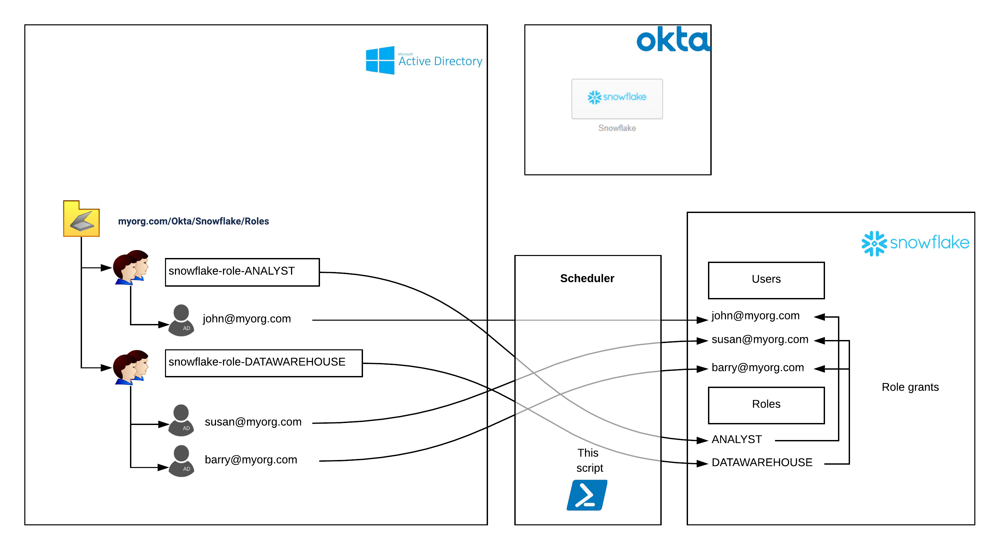

# snoad (beta)

A Powershell script which replicates users and groups from Active Directory into Snowflake

## Script Behaviour
Using an Active Directory Organisational Unit (OU) as a source, the script retrieves all security groups within that OU, along with all users (including those within nested groups). For this reason, the script 
must be ran on a domain-connected Windows machine.

The list of all possible users is checked against Snowflake to ensure they all exist. If any are missing, they are either created or an error is raised, depending on the value of the createAnyMissingUsers parameter.

For each security group immediately within the OU, a role in Snowflake is matched or created and all Snowflake users are granted it according to their membership in the AD security group. Any users who have subsequently been removed from the AD group will be revoked from the corresponding role.

If disableRemovedUsers is set to $true, any SSO-based Snowflake users (i.e. those without Snowflake passwords) will be disabled if they aren't part of any of the AD groups.



## Example
```
.\snoad.ps1 -snowflakeAccount 'ly12345' -snowflakeUser 'usersync' -snowflakeRole 'ACCOUNTADMIN' -snowflakeRegion 'ap-southeast-2' -ouIdentity 'OU=AsiaPacific,OU=Sales,OU=UserAccounts,DC=FABRIKAM,DC=COM' -createAnyMissingUsers $true
```

## Notes

You must have snowsql installed and on your path prior to running this function.

Does not incur compute costs as user account administration does not run in a warehouse.

**This is a community-developed script, not an official Snowflake offering. It comes with no support.**

## License

This project is licensed under the MIT License - see the [LICENSE](LICENSE) file for details
